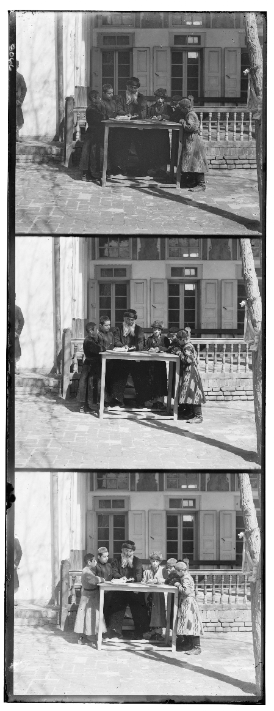
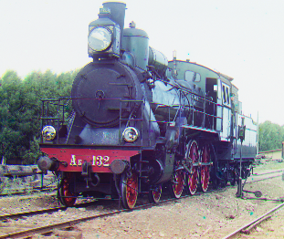
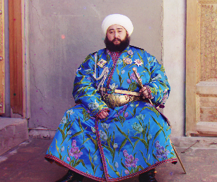
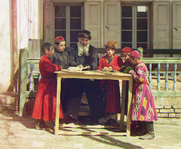

# Prokudin-Gorsky

## Installation
Script is tested on Python 3.6.1. To install required libraries run:

```
pip install -r requirements.txt
```

## Input data
Input is a camera photo containing each color channel in grayscale

  

## Usage

### Aligning directory of images
```
$ python app.py align_images --help                 
Usage: app.py align_images [OPTIONS] img dest

  Aligns channels from images in IMG directory and saves colored versions in
  DEST directory
```

### Aligning single image
```
$ python app.py align_image --help 
Usage: app.py align_image [OPTIONS] IMG DEST

  Aligns channels from image IMG and saves colored version as DEST image
```

## Results




 